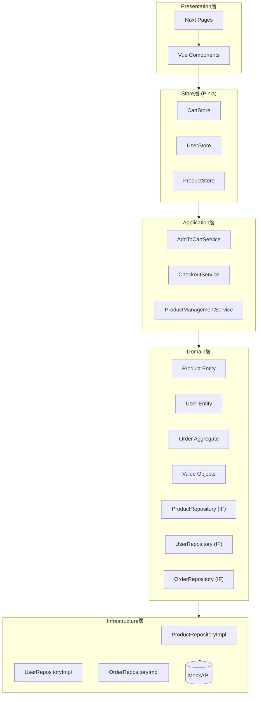
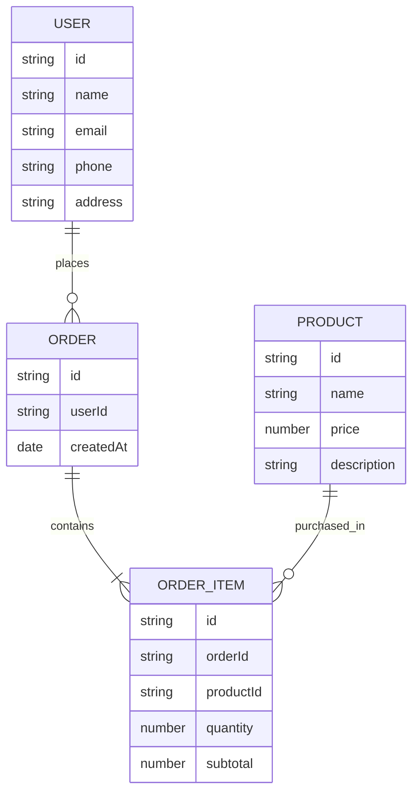
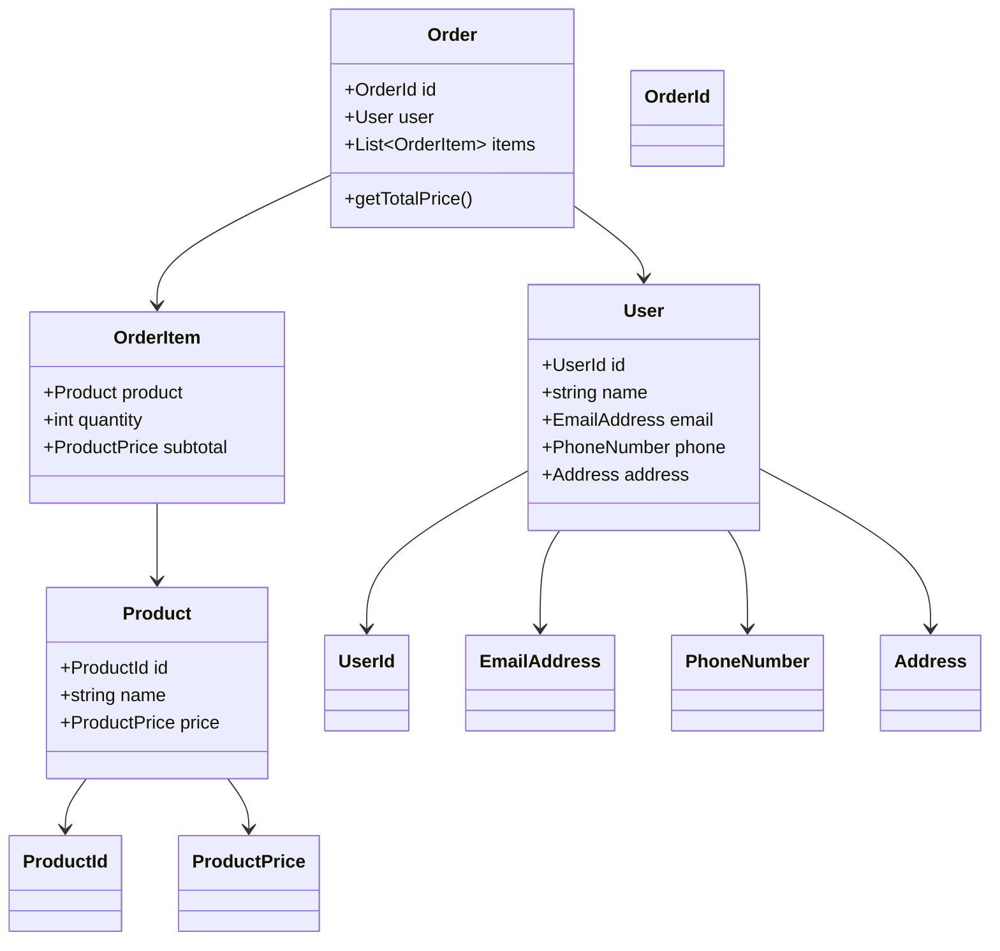

## 1. プロジェクト概要
- **アプリ名**: Simple E-Commerce Study App  
- **目的**: Nuxt.js 3 と Vue を学習しつつ、SIer 開発の典型要素（商品管理 / 注文フロー / マスタ管理）を体験できるアプリを構築する。  
- **開発規模**: 学習用ミニマム実装（認証・決済は省略）  
- **UI**: Tailwind CSS (CDN) を利用したシンプル設計  

## 2. 要件定義

### 機能一覧
1. **商品一覧表示**  
2. **商品詳細表示**  
3. **カート機能**（数量管理つき）  
4. **購入フロー**（フォーム入力 → 確認 → 完了）  
5. **商品マスタ管理**（商品CRUDをモックAPI経由で実現）  

## 3. アーキテクチャ設計

### 層構成（DDD準拠）
- Presentation層: Nuxtページ、Vueコンポーネント  
- Store層: Piniaによる状態保持  
- Application層: ユースケース単位のサービス  
- Domain層: エンティティ / 値オブジェクト / リポジトリインターフェース  
- Infrastructure層: Repository実装（MockAPI通信）  

## 4. ドメインモデル設計

### 4.1 商品 (Product)
- Entity:  
  - `Product` (id: ProductId, name: string, price: ProductPrice, description: string, imageUrl: string)  
- Value Object:  
  - `ProductId`, `ProductPrice`  
- Repository:  
  - `ProductRepository`  
    - `findAll`, `findById`, `save`, `delete`  

### 4.2 ユーザー (User)
- Entity:  
  - `User` (id: UserId, name: string, email: EmailAddress, phone: PhoneNumber, address: Address)  
- Value Object:  
  - `UserId`, `EmailAddress`, `PhoneNumber`, `Address`  
- Repository:  
  - `UserRepository`  

### 4.3 注文 (Order)
- Aggregate Root:  
  - `Order` (id: OrderId, user: User, items: OrderItem[])  
- Value Object:  
  - `OrderItem`, `OrderId`  
- Domain Service:  
  - `OrderService`（合計金額計算、妥当性チェック）  
- Repository:  
  - `OrderRepository`  

## 5. ユースケース（Application層）
- `AddToCartService`: 商品をカートに追加する  
- `CheckoutService`: 注文確定処理  
- `ProductManagementService`: 商品CRUD操作  

## 6. API設計（MockAPI使用想定）
- `GET /products`  
- `GET /products/:id`  
- `POST /products`  
- `PUT /products/:id`  
- `DELETE /products/:id`  
- `POST /orders`  
- `POST /users`  

## 7. 画面設計（ページ単位）
- `/` (商品一覧)  
- `/products/[id]` (商品詳細)  
- `/cart` (カート)  
- `/checkout` → 入力フォーム  
- `/checkout/confirm` → 確認画面  
- `/checkout/complete` → 完了画面  
- `/admin/products` (マスタ一覧)  
- `/admin/products/new` (商品追加)  
- `/admin/products/[id]/edit` (商品編集)  

## 8. 状態管理 (Pinia)
- `cart.ts` → カート情報  
- `user.ts` → ユーザー情報  
- `product.ts` → 商品キャッシュ  

## 9. 開発規約
- TypeScript必須  
- Entity/VOは`readonly`を基本  
- Repositoryは必ずインターフェース経由  
- DDDの責務分離を守る  

## 10. 図解設計

### 10.1 レイヤー構造

---

### 10.2 ER図

---

### 10.3 クラス図イメージ

## 11. 学習の重点
- Nuxt 3 のルーティングと pages ディレクトリ駆動設計  
- Pinia の状態管理（DDDとApplication層をつなぐ）  
- DDD的設計（Entity, VO, Repository, Aggregate の分離）  
- API抽象化によるモックと本番API切替えの容易化  
